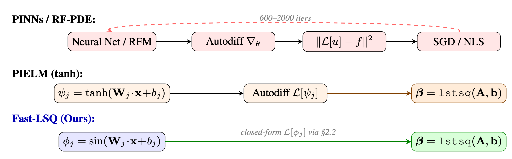

# FastLSQ

<p align="center">
  
</p>

**Solving PDEs in one shot via Fourier features with exact analytical derivatives.**

FastLSQ is a lightweight PDE solver that uses Random Fourier Features with
`sin` activation and closed-form first- and second-order derivatives.
Linear PDEs are solved in a single least-squares step; nonlinear PDEs are
solved via Newton-Raphson iteration with Tikhonov regularisation,
1/sqrt(N) feature normalisation, and continuation/homotopy.

## Installation

```bash
pip install -r requirements.txt
pip install -e .
```

Or simply install the dependencies manually:

```bash
pip install torch numpy matplotlib
```

## Quick start

### Linear PDE benchmark

```bash
python examples/run_linear.py
```

Runs a grid search over bandwidth scales for 15 PDE/regression problems,
comparing Fast-LSQ (sin) against PIELM (tanh).  Sensitivity plots are
saved as PDF files.

### Nonlinear PDE benchmark

```bash
python examples/run_nonlinear.py
```

Runs Newton-Raphson Fast-LSQ on five nonlinear PDE problems (NL-Poisson,
Bratu, steady Burgers with continuation, NL-Helmholtz, Allen-Cahn).
Convergence plots are saved as PDF files.

## Method overview

1. **Feature construction.** Given collocation points x, compute
   `H = sin(x W + b)` together with exact derivatives
   `dH = cos(x W + b) * W` and `ddH = -sin(x W + b) * W^2`.

2. **Linear solve.** Assemble the PDE operator in feature space:
   `A beta = b`, and solve via least squares (optionally Tikhonov-regularised).

3. **Newton iteration (nonlinear).** Linearise the PDE residual around the
   current iterate, solve `J delta_beta = -R` with backtracking line search,
   and repeat until convergence.

## Paper

The full preprint is available on [arXiv](https://arxiv.org/abs/2602.10541)

## Citing this work

If you use FastLSQ in your research, please cite:

```bibtex
@misc{sulc2026solvingpdesshotfourier,
      title={Solving PDEs in One Shot via Fourier Features with Exact Analytical Derivatives},
      author={Antonin Sulc},
      year={2026},
      eprint={2602.10541},
      archivePrefix={arXiv},
      primaryClass={math.NA},
      url={https://arxiv.org/abs/2602.10541},
}
```

## License

This project is licensed under the MIT License -- see [LICENSE](LICENSE) for details.
